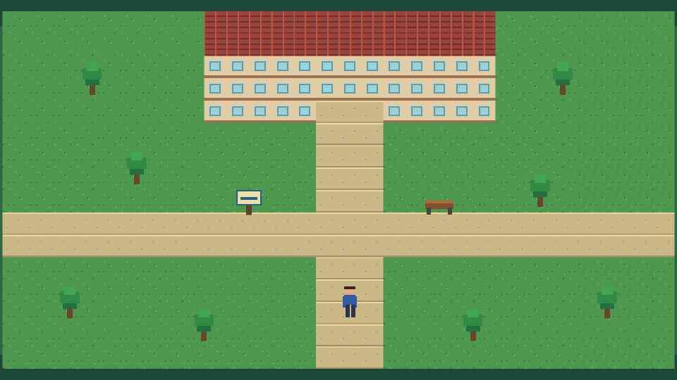

# Sobreviviendo al Primer Semestre

Proyecto del Grupo 64 para la evaluación procesual Hito 2 de Programación Gráfica y Multimedia I.

## Descripción

`Sobreviviendo al Primer Semestre` es un videojuego 2D de simulación de vida y aventura ligera. El jugador representa a un estudiante de primer ingreso que explora el campus universitario, conoce sus servicios y aprende a equilibrar estudio, energía y vida social.

En este hito se presenta la primera base visual y técnica del proyecto: una escena 2D de la entrada del campus, organizada para continuar el desarrollo durante el semestre. Además de los requisitos evaluados, el prototipo permite mover y animar horizontalmente al personaje.

## Género

- Simulación de vida.
- Aventura RPG ligera.
- Exploración y gestión de recursos en etapas posteriores.

## Plataforma objetivo

- PC con Windows.
- Posible publicación WebGL en hitos posteriores.

## Estilo visual

Pixel art 2D con vista superior. Se utilizan formas y colores sencillos para representar césped, senderos, edificios, árboles, mobiliario y señalización universitaria.

## Idea inicial

El jugador llegará por primera vez a la universidad y deberá aprender a orientarse en el campus. En versiones posteriores podrá hablar con personajes, realizar trámites, asistir a clases y tomar decisiones para equilibrar su rendimiento académico, energía y vida social.

## Tecnologías

- Unity 6000.3.16f1.
- Unity 2D y Tilemap.
- Git para control de versiones.
- GitHub para colaboración.

## Integrantes

| Integrante | Usuario de GitHub | Responsabilidad principal |
| --- | --- | --- |
| Alejandro Villalpando Rojas | `Alexwuuu1` | Repositorio, proyecto Unity y estructura inicial |
| Cristopher Iori Lazcano Gutierrez | `Crisshubb` | Fondo y elementos decorativos |
| Galilea Alison Llusco Asistiri | `Galileya` | Tiles y escenario con Tilemap |
| Alex Joel Quispe Ticona | `lpzealexjoelquispeti-dot` | README, bitácora y revisión |

> Los cuatro integrantes ya aparecen como colaboradores. Antes de la entrega, cada integrante debe realizar al menos un commit real desde su propia cuenta de GitHub.

### Evidencia de participación

| Cuenta | Estado comprobado |
| --- | --- |
| `Alexwuuu1` | Commits reconocidos por GitHub |
| `Crisshubb` | Commits reconocidos por GitHub en `feature/fondo-campus`, `develop` y `main` |
| `lpzealexjoelquispeti-dot` | Existe el aporte `Añadir nuevos sprites a la carpeta Art`, pero su correo todavía no está vinculado por GitHub a esta cuenta |
| `Galileya` | Colaboradora con permiso de escritura; commit individual pendiente |

## Estado del proyecto

Prototipo 2D jugable. La escena contiene cámara ortográfica, fondo, una sección del campus creada con tiles, elementos visuales relacionados con la temática y un personaje animado con movimiento horizontal.

## Estructura del proyecto

```text
Assets/
├── Art/
│   ├── Backgrounds/   Fondo original del campus
│   ├── Characters/    Marcador visual del estudiante
│   ├── Decorations/   Árboles, banco y señal
│   ├── Tiles/         Sprites y objetos Tile
│   └── UI/            Recursos reservados para la interfaz
├── Editor/            Herramienta reproducible de preparación del hito
├── Materials/         Materiales futuros
├── Prefabs/           Prefabs futuros
├── Scripts/           Movimiento y animación horizontal del personaje
└── Scenes/
    └── Nivel01.unity  Escena inicial evaluable

Packages/              Dependencias de Unity
ProjectSettings/       Configuración del proyecto
Docs/                  Guías internas y vista previa
SourceAssets/          Fuentes editables de Aseprite aportadas por el equipo
```

Las carpetas `Library/`, `Temp/`, `Logs/` y `UserSettings/` se generan localmente y están excluidas mediante `.gitignore`.

## Ejecución

1. Clonar o descargar el repositorio.
2. Abrir Unity Hub.
3. Seleccionar **Add project from disk**.
4. Elegir la carpeta raíz del repositorio.
5. Abrir el proyecto con Unity `6000.3.16f1` o una versión compatible.
6. Abrir `Assets/Scenes/Nivel01.unity`.
7. Presionar **Play** para probar la escena y el movimiento del personaje.

Al presionar Play, el personaje se mueve horizontalmente con `A`/`D` o con las flechas izquierda/derecha. Su sprite se anima mientras camina y cambia de orientación según la dirección.

## Escena inicial

La escena `Nivel01` representa la entrada al campus e incluye:

- Cámara ortográfica 2D.
- Fondo visual.
- Grid y dos Tilemaps organizados.
- Césped y senderos construidos con tiles.
- Edificio principal construido con tiles.
- Árboles, banco, señal y personaje provisional.
- Composición visual coherente con la temática universitaria.



## Assets

Los gráficos son originales del Grupo 64. Una parte se genera mediante `Assets/Editor/Hito2Setup.cs` y otra corresponde a aportes directos de los integrantes. No se copiaron paquetes gráficos de otros videojuegos.

| Asset | Autoría | Uso dentro del proyecto |
| --- | --- | --- |
| `CampusBackground.png` | Grupo 64 | Fondo general de la escena |
| `GrassTile.png` | Grupo 64 | Suelo del campus |
| `PathTile.png` | Grupo 64 | Senderos peatonales |
| `WallTile.png` | Grupo 64 | Paredes del edificio |
| `RoofTile.png` | Grupo 64 | Techo del edificio |
| `Tree.png` | Grupo 64 | Decoración del campus |
| `Bench.png` | Grupo 64 | Mobiliario exterior |
| `CampusSign.png` | Grupo 64 | Señalización |
| `Student.png` | Grupo 64 | Personaje provisional generado durante la preparación inicial |
| `PlayerWalkRight.png` | Grupo 64, proporcionado por Alejandro | Hoja de cuatro fotogramas usada por el personaje jugable |
| `CampusMapHorizontal_256x128.png` | Cristopher Iori Lazcano Gutierrez (`Crisshubb`) | Fondo horizontal alternativo del campus |
| `StudentCampus_24x32.png` | Cristopher Iori Lazcano Gutierrez (`Crisshubb`) | Personaje alternativo del pack visual |
| `Tiles/CampusPack/*` | Cristopher Iori Lazcano Gutierrez (`Crisshubb`) | Ocho tiles de 16×16 para ampliar el Tilemap |
| `Decorations/CampusPack/*` | Cristopher Iori Lazcano Gutierrez (`Crisshubb`) | Árbol, banco, lámpara y quiosco para el escenario |
| `SourceAssets/Aseprite/Sprite-0001.ase` a `Sprite-0004.ase` | Grupo 64; incorporados al repositorio por Alex Joel | Fuentes editables de escenarios y animaciones |

El detalle técnico del aporte de Cristopher se encuentra en [`Assets/Art/CAMPUS_PACK.md`](Assets/Art/CAMPUS_PACK.md). Uso autorizado únicamente para el proyecto académico del Grupo 64. Si posteriormente se incorporan recursos externos, deberá registrarse su autor, URL y licencia en esta sección.

## Flujo de trabajo

- `main`: versión estable presentada.
- `develop`: integración del trabajo del equipo.
- `feature/*`: cambios específicos de cada integrante.

Flujo utilizado:

1. Crear `develop` desde `main`.
2. Crear una rama `feature/nombre-tarea` desde `develop`.
3. Realizar cambios y commits descriptivos en la rama feature.
4. Integrar la rama feature en `develop` mediante merge.
5. Comprobar el resultado en Unity.
6. Integrar `develop` en `main` para preparar la entrega estable.

## Documentación adicional

- [Bitácora](BITACORA.md)
- [Pasos para completar la entrega](Docs/PASOS_PARA_ENTREGA.md)
- [Guía para la defensa oral](Docs/GUIA_DEFENSA.md)
